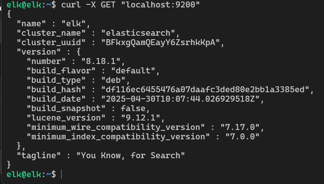
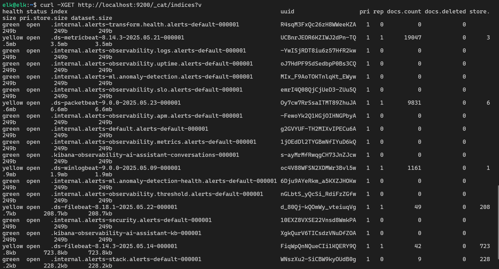

# Hướng Dẫn Cài Đặt Elasticsearch, Kibana, Filebeat Trên Ubuntu 22.04
## 1. Cập nhật hệ thống và cài Java

```bash
sudo apt update
sudo apt install apt-transport-https -y
sudo apt install openjdk-11-jdk -y
java -version
```

## 2. Thiết lập biến môi trường JAVA_HOME

```bash
sudo nano /etc/environment
```

Thêm dòng sau vào cuối file:

```env
JAVA_HOME="/usr/lib/jvm/java-11-openjdk-amd64"
```

Tải lại môi trường:

```bash
source /etc/environment
echo $JAVA_HOME
```

---

## 3. Cài đặt Elasticsearch 8

### Thêm khóa GPG và repository

```bash
wget -qO - https://artifacts.elastic.co/GPG-KEY-elasticsearch | sudo gpg --dearmor -o /usr/share/keyrings/elasticsearch-keyring.gpg

echo "deb [signed-by=/usr/share/keyrings/elasticsearch-keyring.gpg] https://artifacts.elastic.co/packages/8.x/apt stable main" | sudo tee /etc/apt/sources.list.d/elastic-8.x.list
```

### Cài đặt Elasticsearch

```bash
sudo apt-get update
sudo apt-get install elasticsearch -y
```

### Khởi động Elasticsearch

```bash
sudo systemctl start elasticsearch
sudo systemctl enable elasticsearch
sudo systemctl status elasticsearch
```

---

## 4. Cấu hình Elasticsearch

```bash
sudo nano /etc/elasticsearch/elasticsearch.yml
```

Chỉnh sửa hoặc thêm các dòng sau:

```yaml
network.host: 0.0.0.0
discovery.seed_hosts: []
xpack.security.enabled: false
```

Sau đó khởi động lại:

```bash
sudo systemctl restart elasticsearch
```

### Kiểm tra

```bash
curl -X GET "localhost:9200"
```

Kết quả:



---

## 5. Cài đặt và cấu hình Kibana

```bash
sudo apt-get install kibana -y

sudo systemctl start kibana
sudo systemctl enable kibana
sudo systemctl status kibana
```

### Cấu hình Kibana

```bash
sudo nano /etc/kibana/kibana.yml
```

Thêm hoặc chỉnh sửa:

```yaml
server.port: 5601
server.host: "0.0.0.0"
elasticsearch.hosts: ["http://localhost:9200"]
```

Khởi động lại Kibana:

```bash
sudo systemctl restart kibana
```

Kết quả sau khi truy cập Kibana:


---

## 6. Cài đặt và cấu hình Filebeat

```bash
sudo apt-get install filebeat -y
```

### Cấu hình Filebeat

```bash
sudo nano /etc/filebeat/filebeat.yml
```

Bật đầu ra Elasticsearch:

```yaml
output.elasticsearch:
  hosts: ["http://localhost:9200"]
```

### Kích hoạt module system

```bash
sudo filebeat modules enable system
```

### Thiết lập index template

```bash
sudo filebeat setup --index-management -E output.logstash.enabled=false -E 'output.elasticsearch.hosts=["0.0.0.0:9200"]'
```

### Khởi động Filebeat

```bash
sudo systemctl start filebeat
sudo systemctl enable filebeat
sudo systemctl status filebeat
```

---

## 7. Kiểm tra Elasticsearch nhận log

```bash
curl -XGET http://localhost:9200/_cat/indices?v
```
### Kết quả

---
